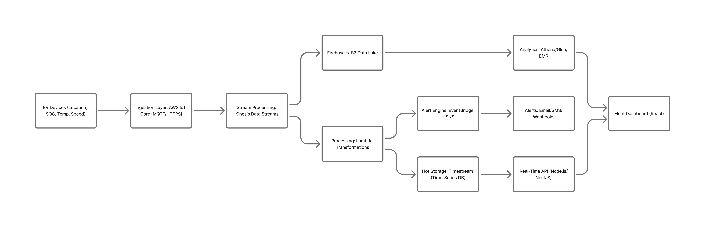

# **Volt Fleet – IoT Architecture (NestJS + AWS)**

A scalable, event-driven IoT telemetry platform for electric vehicles (EVs).
Designed to ingest real-time data from thousands of vehicles, process it, store it efficiently, trigger alerts, and provide live dashboards for fleet operators.

This project is part of a system design assessment and focuses on architectural reasoning, AWS cloud services, backend structure, and telemetry processing.


## **Overview**

Modern EV fleets generate a continuous stream of telemetry:
GPS location, battery SOC, temperature, speed, and diagnostics.
This platform provides:

* High-volume ingestion via AWS IoT Core
* Real-time stream processing (Kinesis + Lambda)
* Time-series storage for analytics (Timestream / S3)
* Operational data via PostgreSQL
* Real-time dashboards using NestJS WebSockets
* Automated alerting for fleet managers


## **Architecture Diagram**



**Data Flow:**
**Vehicle → AWS IoT Core → Kinesis Stream → Lambda → Timestream/S3/Postgres → API (NestJS) → Dashboard & Alerts**


## **Technology Choices**

### **Backend**

* **NestJS (Node.js, TypeScript)**– modular, scalable, enterprise-ready.
* **WebSockets Gateway**– live telemetry updates.

### **AWS Services**

* **AWS IoT Core**– secure ingestion (MQTT/HTTPS).
* **Kinesis Data Streams**– durable, scalable streaming buffer.
* **AWS Lambda**– serverless event processing.
* **Amazon Timestream**– optimized time-series store.
* **Amazon S3 + Firehose**– long-term, low-cost analytics storage.
* **Amazon RDS (PostgreSQL)**– fleet/vehicle relational data.
* **EventBridge + SNS**– rules-based alerts.
* **CloudWatch + X-Ray**– observability, metrics, tracing.


## **Scalability & Reliability**

* Horizontally scalable ingestion via IoT Core + Kinesis shards
* Fully serverless processing layer
* Multi-AZ RDS + autoscaling
* Durable S3 cold storage
* WebSocket cluster backed by Redis Pub/Sub
* Backpressure protection via Kinesis consumer lag alarms

Failures are isolated at each stage with retries, DLQs, and circuit breaking.


## **Telemetry Endpoints (NestJS)**

### **POST /telemetry/ingest**

Ingest real-time telemetry from vehicles.

### **GET /telemetry/:vehicleId/latest**

Fetch latest known telemetry record.

### **GET /telemetry/:vehicleId/history**

Query historical telemetry with pagination & date filtering.


## **Entities**

### **Vehicle**

* id
* fleetId
* vin
* model
* status

### **Telemetry**

* vehicleId
* latitude
* longitude
* speed
* soc
* temperature
* createdAt

### **Fleet**

* id
* name
* manager


## **Real-Time Dashboard**

The backend exposes a WebSocket gateway:

```
ws://host/telemetry
```

Events:

* `telemetry.update` — emitted on every vehicle event
* Rooms per fleet for scoped broadcasting


## **Alerting Rules**

* SOC < 15%
* Speed > 120 km/h
* Temperature > 80°C
* No telemetry for > 5 minutes
* Kinesis consumer lag

Alerts delivered via SNS → Email/SMS or webhook.


## **Monitoring**

Dashboards track:

* Stream throughput
* Lambda duration & errors
* IoT Core connection failures
* Database load
* Fleet-level SOC distribution
* Live vehicle map


## **Folder Structure**

```bash
src/
  telemetry/
    telemetry.controller.ts
    telemetry.service.ts
    telemetry.gateway.ts
    dto/
    entities/
  vehicles/
  notification/
  fleets/
  common/
  ...
```


## **Local Development**

Clone the repo:

```bash
git clone https://github.com/<your-username>/volt-fleet.git
cd ev-telemetry-platform
yarn install
yarn start:dev
```


## **Summary**

This project demonstrates a production-grade telemetry architecture combining IoT, serverless processing, time-series analytics, and real-time monitoring, optimized for thousands of concurrent vehicles and fleet managers. Here is the link to the project document: https://docs.google.com/document/d/19Orn386o4Sti1kSX8til-DNrfm_20Jvmb1BYRs504hM/edit?tab=t.0


